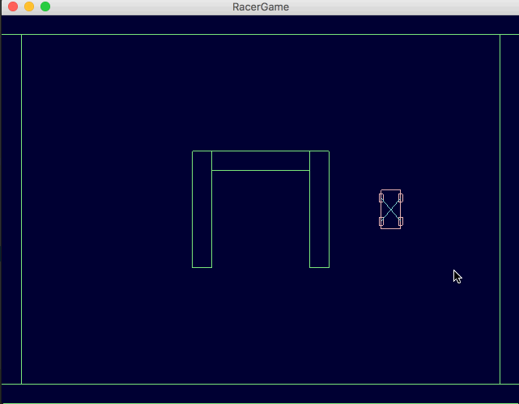

# Mini racer with GDX

Top to down test racer game to try out:

* Libgdx
* Kotlin (Converted back to java for GWT support)
* Box2d

Try out [game](http://545149.s.dedikuoti.lt/racer/) compiled with GWT.
As far as I've tried, runs on all platforms (mac desktop, android tablet/phone, iphone).

### Refs

* [Test game in java](https://github.com/signalsin/Racer)
* [Physics tutorial](http://www.iforce2d.net/b2dtut/top-down-car)
